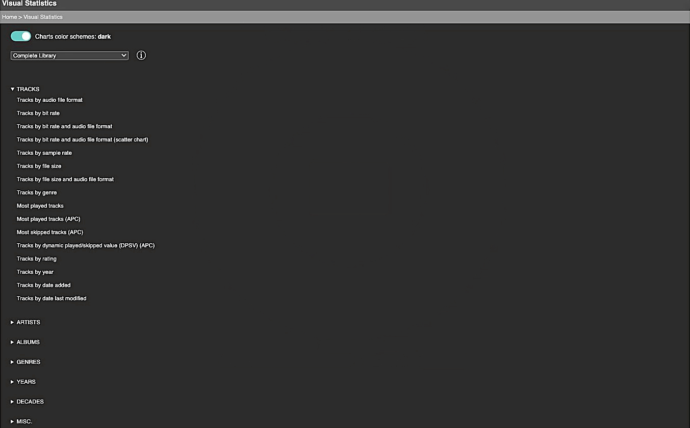

Visual Statistics
====
%3D'plugin'%20and%20%40name%3D'VisualStatistics'%5D%2F%40minTarget&prefix=v&label=Min.%20LMS%20Version%20Required&color=darkgreen) 

With **Visual Statistics**[^1] you can display statistics of your LMS music library using all kinds of charts. Hovering over segments, bars or data points will display more information. 

If you're interested in lists with tracks, albums or artists sorted by statistics for a specific artist, album, genre, year/decade or playlist, have a look at the [**Context Stats**](https://github.com/AF-1/#-context-stats) plugin. 

> [!TIP]
> You can find the menus / GUI here: `Home Menu > Extras > Visual Statistics`

 
While the charts scale down, please note that this plugin was designed for wide/big screens.
  
If you have the [**Alternative Play Count**](https://github.com/AF-1/#-alternative-play-count) plugin installed, you will see some additional charts that use the data from this plugin.
  
[⬅️ **Back to the list of all plugins**](https://github.com/AF-1/)
  
**Use the** &nbsp;  &nbsp;**icon** (top right) to **jump directly to a specific section.**

  

## Features:
- Display statistics of your LMS music library using various types of charts.
- Save charts as images.
- 💡 The <b>bars</b> in many <i>bar charts</i> are <b>clickable</b> and will take you directly to the <b>browse menu</b> of the <i>artist, album, genre or year</i>.
- Limit the scope of charts to virtual libraries, decades and/or genres.
- Display (summary) library statistics in text form.
- Save the results for selected text statistics as playlists. Makes it easier to find those tracks, albums and artists.

  

## Screenshots[^2]

  

## Installation

*Visual Statistics* is available from the LMS plugin library: `LMS > Settings > Manage Plugins`. 

If you want to test a new patch that hasn't made it into a release version yet, you'll have to [install the plugin manually](https://github.com/AF-1/sobras/wiki/Manual-installation-of-LMS-plugins).
    

## Report a new issue

To report a new issue please file a GitHub [**issue report**](https://github.com/AF-1/lms-visualstatistics/issues/new/choose).
   

## ⭐ Help others discover this project

If you find this project useful, giving it a  (top right of this page) is a great way to show your support and help others discover it. Thank you.
    

[^1]: If you want localized strings in your language, please read <a href="https://github.com/AF-1/sobras/wiki/Adding-localization-to-LMS-plugins"><b>this</b></a>.
[^2]: The screenshots might not correspond to the UI of the latest release in every detail.
